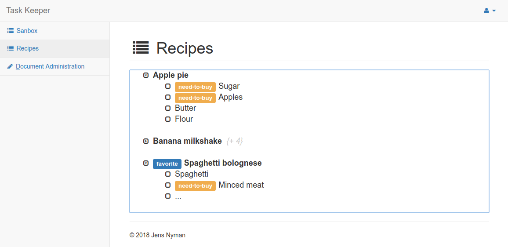

Piga
======================

[](https://travis-ci.org/nymanjens/piga)

TODO

## Screenshot



## Installation

- Clone this repository or download the files
- Run following commands to get the app running:

    ```
    # refresh application secret
    sbt playUpdateSecret

    # Build application
    sbt dist

    # Deploy files
    cd /somewhere/you/want/the/files
    unzip .../target/universal/piga-1.0-SNAPSHOT.zip
    mv piga-1.0-SNAPSHOT/* .
    rm -d piga-1.0-SNAPSHOT/

    # Create database tables
    bin/piga -DdropAndCreateNewDb
    rm RUNNING_PID

    # Create admin user
    bin/piga -DcreateAdminUser
    rm RUNNING_PID

    # Run application
    bin/piga
    ```

## Configuration
- `conf/application.conf`:<br>
  Setup and configure a database here.
- Add users:<br>
  A default user is created with the `-DcreateAdminUser` flag (username: admin, password:
  changeme). This account can create new users.
